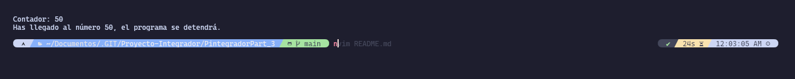

# Programa de Contador Interactivo

Este es un simple programa interactivo de contador desarrollado en Python. Permite al usuario incrementar un contador presionando una tecla específica y detener el programa presionando otra tecla.

## Requisitos

- Python 3.x
- Módulo `readchar`

## Instalación

1. Asegúrate de tener Python instalado. Puedes descargarlo desde [el sitio oficial de Python](https://www.python.org/downloads/).
2. Instala el módulo `readchar` ejecutando el siguiente comando en tu terminal:

## Uso

1. Ejecuta el programa `contador.py` en tu terminal.
2. Se te pedirá que presiones 'n' para incrementar el contador y una flecha hacia arriba (🡩) para detener el programa.
3. Sigue las instrucciones en pantalla para interactuar con el programa.

## Ejemplo de Interacción

